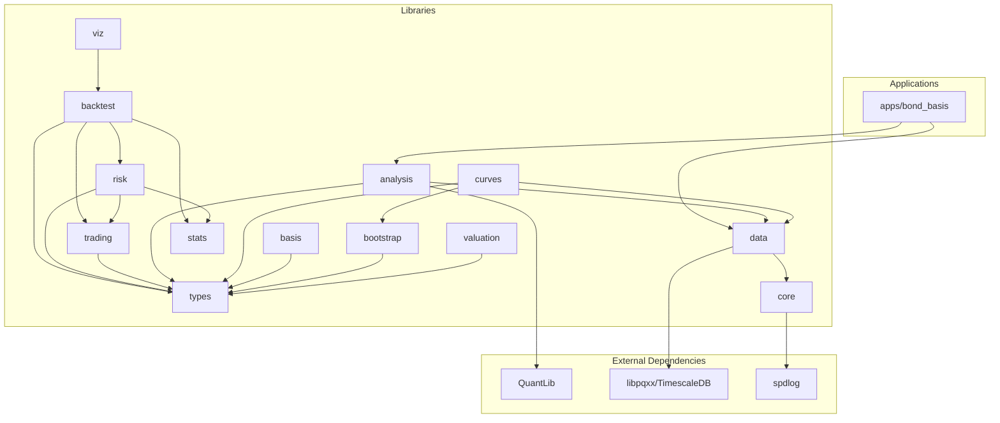
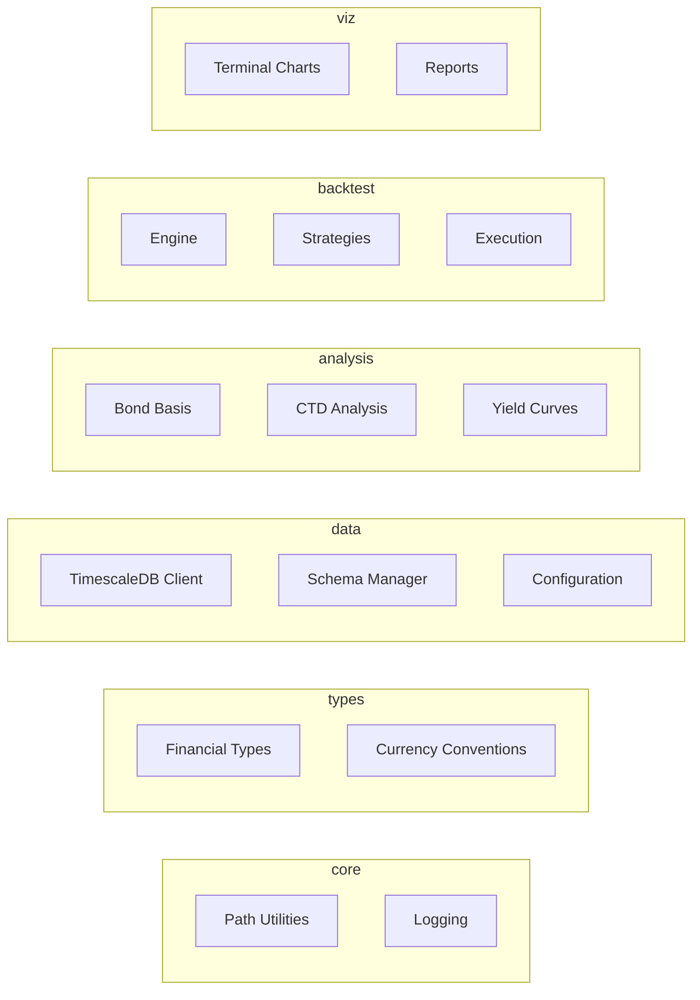
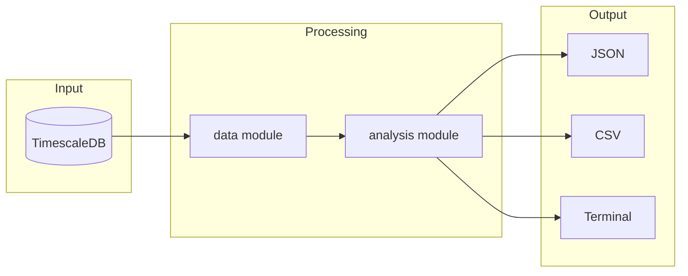
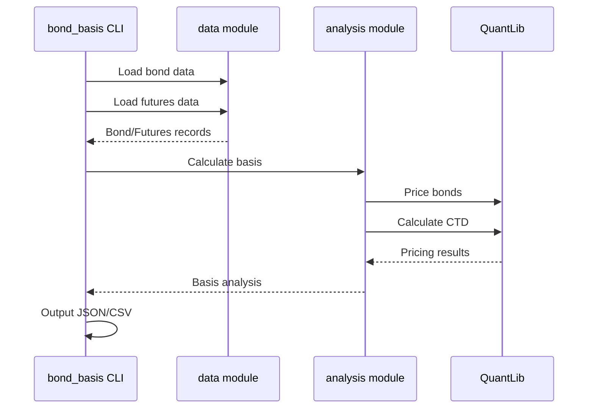

# Module Overview

## Dependency Graph

```mermaid
graph TD
    subgraph "Applications"
        A[apps/bond_basis]
    end

    subgraph "Libraries"
        V[viz]
        B[backtest]
        AN[analysis]
        CU[curves]
        BS[basis]
        BT[bootstrap]
        VAL[valuation]
        R[risk]
        TR[trading]
        ST[stats]
        D[data]
        T[types]
        C[core]
    end

    subgraph "External Dependencies"
        QL[QuantLib]
        PQ[libpqxx/TimescaleDB]
        SPD[spdlog]
    end

    A --> AN
    A --> D

    V --> B
    B --> TR
    B --> R
    B --> ST
    B --> T
    R --> TR
    R --> ST
    R --> T
    TR --> T
    AN --> D
    AN --> T
    AN --> QL
    CU --> D
    CU --> BT
    CU --> T
    BS --> T
    BT --> T
    VAL --> T
    D --> C
    D --> PQ
    C --> SPD
```

## Module Responsibilities

```mermaid
graph LR
    subgraph core["core"]
        C1[Path Utilities]
        C2[Logging]
    end

    subgraph types["types"]
        T1[Financial Types]
        T2[Currency Conventions]
    end

    subgraph data["data"]
        D1[TimescaleDB Client]
        D2[Schema Manager]
        D3[Configuration]
    end

    subgraph analysis["analysis"]
        A1[Bond Basis]
        A2[CTD Analysis]
        A3[Yield Curves]
    end

    subgraph backtest["backtest"]
        B1[Engine]
        B2[Strategies]
        B3[Execution]
    end

    subgraph viz["viz"]
        V1[Terminal Charts]
        V2[Reports]
    end
```

## Data Flow

```mermaid
flowchart LR
    subgraph Input
        DB[(TimescaleDB)]
    end

    subgraph Processing
        D[data module]
        A[analysis module]
    end

    subgraph Output
        JSON[JSON]
        CSV[CSV]
        TERM[Terminal]
    end

    DB --> D
    D --> A
    A --> JSON
    A --> CSV
    A --> TERM
```

## Bond Basis Analysis Flow

```mermaid
sequenceDiagram
    participant CLI as bond_basis CLI
    participant Data as data module
    participant Analysis as analysis module
    participant QL as QuantLib

    CLI->>Data: Load bond data
    CLI->>Data: Load futures data
    Data-->>CLI: Bond/Futures records

    CLI->>Analysis: Calculate basis
    Analysis->>QL: Price bonds
    Analysis->>QL: Calculate CTD
    QL-->>Analysis: Pricing results
    Analysis-->>CLI: Basis analysis

    CLI->>CLI: Output JSON/CSV
```
